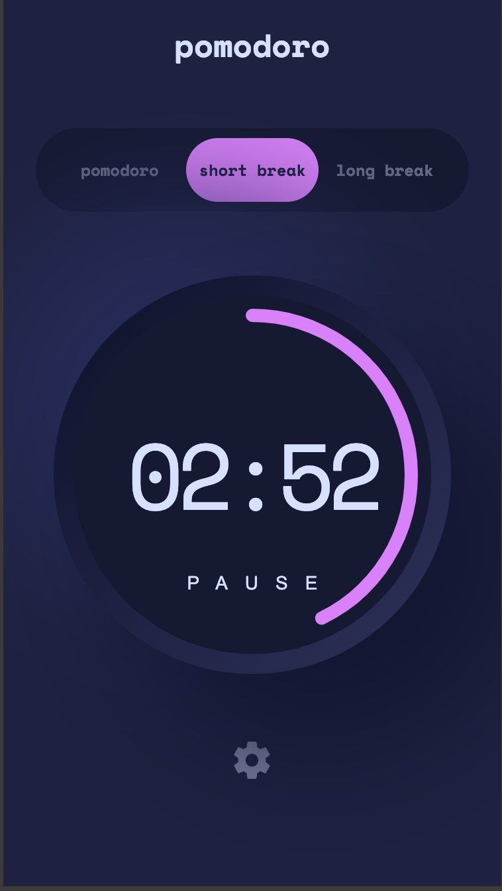
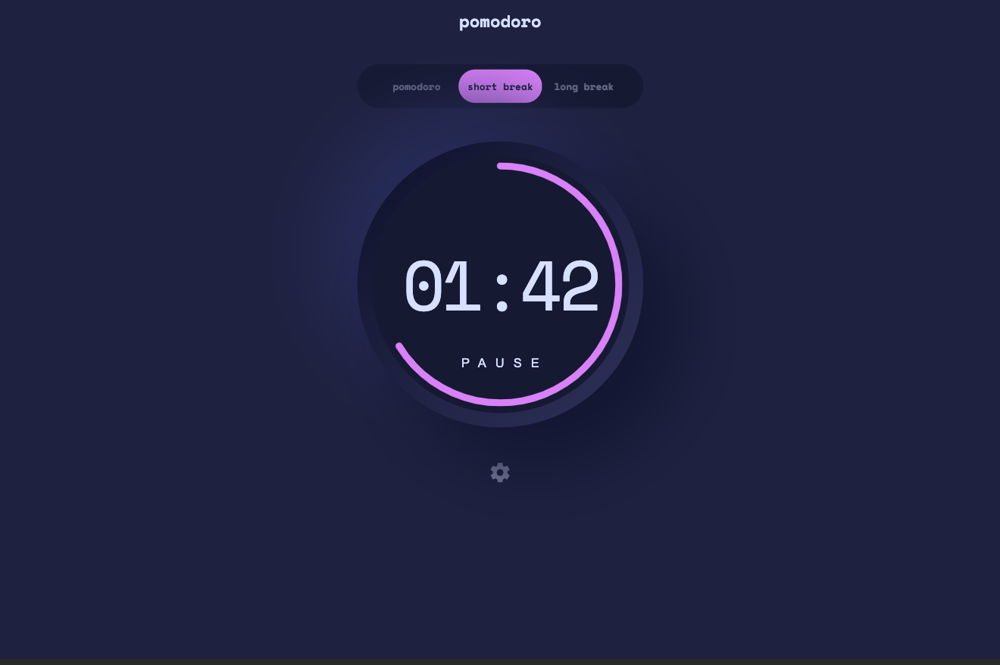
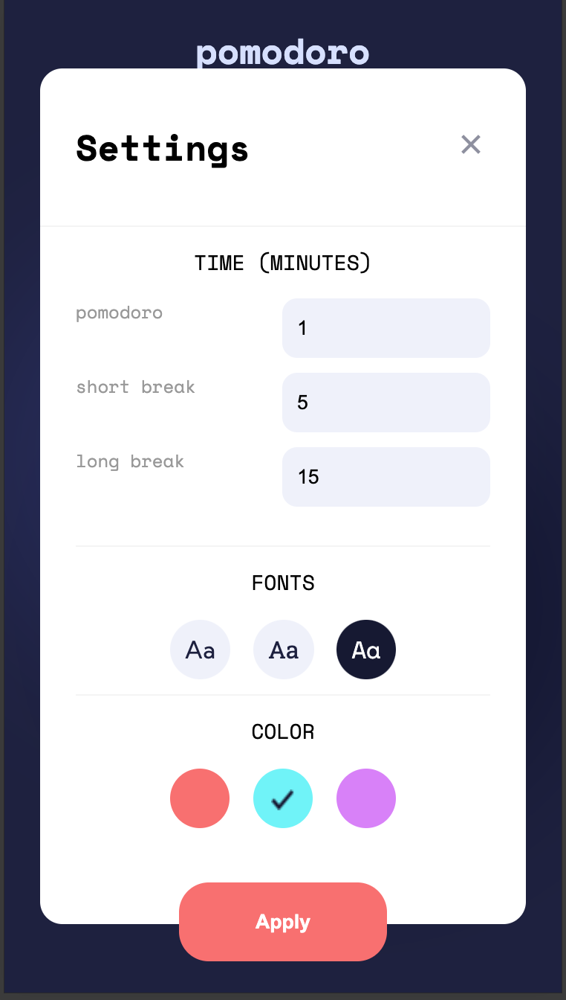
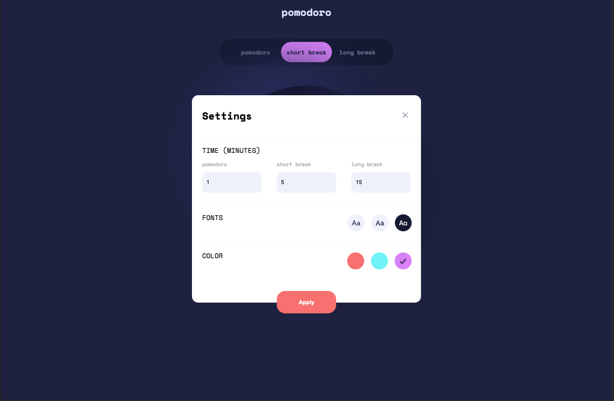

# Frontend Mentor - Pomodoro app solution

This is a solution to the [Pomodoro app challenge on Frontend Mentor](https://www.frontendmentor.io/challenges/pomodoro-app-KBFnycJ6G). Frontend Mentor challenges help you improve your coding skills by building realistic projects.

## Table of contents

- [Overview](#overview)
  - [The challenge](#the-challenge)
  - [Screenshot](#screenshot)
- [My process](#my-process)
  - [Built with](#built-with)

## Overview

### The challenge

Users should be able to:

- Set a pomodoro timer and short & long break timers
- Customize how long each timer runs for
- See a circular progress bar that updates every minute and represents how far through their timer they are
- Customize the appearance of the app with the ability to set preferences for colors and fonts

### Screenshot

---

## Screenshot (Fullscreen)

- 375px, 1440px:

|                                            |                                             |
| ------------------------------------------ | ------------------------------------------- |
|  |  |

- 375px, 1440px:
  | | |
  | ---------------------------------------- | ---------------------------------------- |
  |  |  |

## My process

## Built with

- React JS
- styled-components

##

## Links

-
